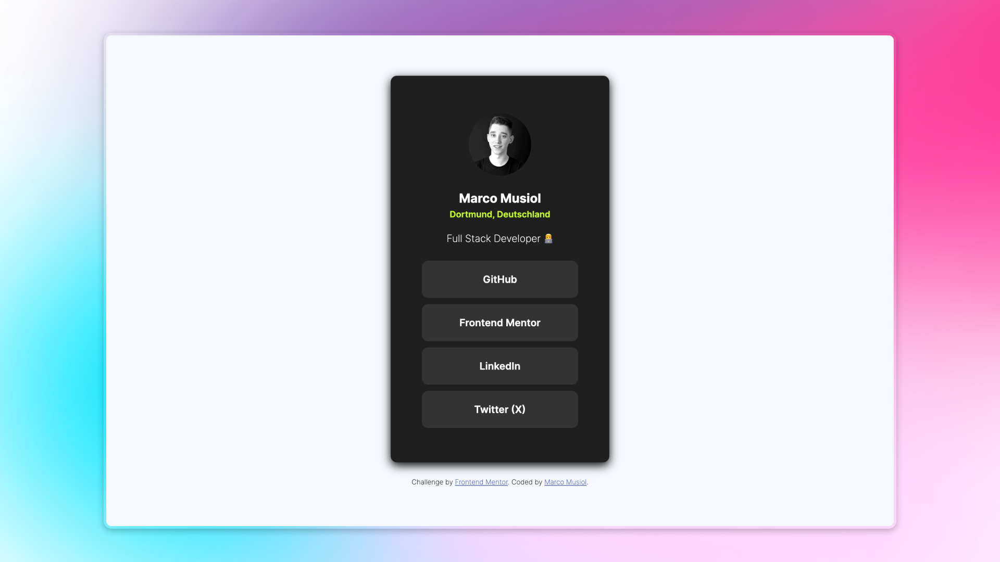

# Frontend Mentor - Social links profile solution

This is a solution to the [Social links profile challenge on Frontend Mentor](https://www.frontendmentor.io/challenges/social-links-profile-UG32l9m6dQ). Frontend Mentor challenges help you improve your coding skills by building realistic projects.

## Overview

### The challenge

Users should be able to:

- See hover and focus states for all interactive elements on the page

### Screenshot

### Links

- Solution URL: https://github.com/musiolmarco/frontend-mentor-social-links-profile
- Live Site URL: https://musiolmarco.github.io/frontend-mentor-social-links-profile/

## My process

### Built with

- HTML5
- Flexbox
- CSS Grid
